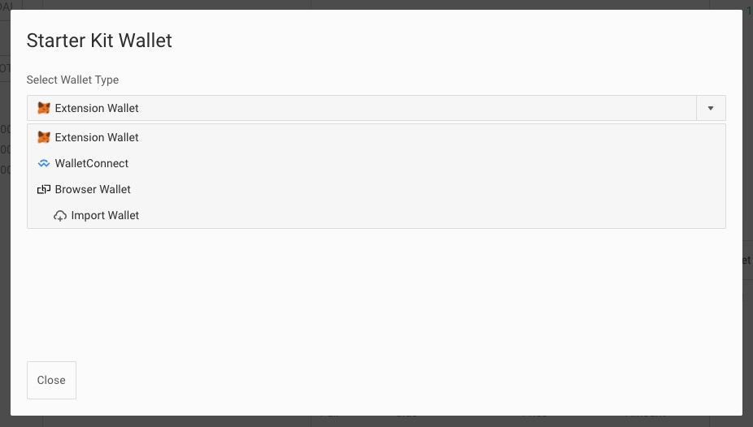

Introduction

Nearly every dapp needs to connect to a crypto wallet.There are many options such as metamask, ledger. Nova sdk wallet makes it easier to integrate different kinds of wallets together, and give an uniform interfaces to interative with them.

Nova SDK wallet also support browser local wallets. Secrets are saved in browser localstorage under your domain.

There is a default ui in this package. You can also implement another ui as you wish.



### Support wallets:

- Metamask
- Wallet Connect Protocol
- Browser Local Wallet
- Ledger Wallet
- Trust Wallet
- Coinbase Wallet
- Imtoken Wallet

## Basic Usage Guide

This package requires `React` and `Redux`.

### Step1: install npm package

`npm i @gongddex/nova-sdk-wallet`

### Step2: Wallet Reducer

The store should know how to handle actions coming from the wallet components. To enable this, we need to pass the `WalletReducer` to your store.

```javascript
import { createStore, combineReducers } from "redux";
import { WalletReducer } from "@gongddex/nova-sdk-wallet";

const rootReducer = combineReducers({
  // ...your other reducers here
  // you have to pass WalletReducer under 'WalletReducer' key
  WalletReducer
});

const store = createStore(rootReducer);
```

### Step3: Wallet Component

To make the wallet logic work. We need to mount the `Wallet` and `WalletButton` components into your app. They should be mounted into `Provider`(see more details about Provider in [react-redux](https://github.com/reduxjs/react-redux)). When the components is initialized, some monitors will start to work as well. They are monitoring the web3 wallet status(not installed, locking, account changed), ledger status(locked or not), and balances of all available addresses. You can config wallet through props. See more datials in the [api section](#wallet-component-props) below.

```javascript
import React from "react";
import { Provider } from "react-redux";
import { Wallet, WalletButton } from "@gongddex/nova-sdk-wallet";
import { store } from "./store";
import "@gongddex/nova-sdk-wallet/index.css";

class App extends React.Component {
  render() {
    return (
      <Provider store={store}>
        // ... your components
        <Wallet nodeUrl="https://ropsten.infura.io" />
        <WalletButton />
      </Provider>
    );
  }
}
```

### Step4: Use Account

We can get the current selected account by using selector functions.

```javascript
import React from "react";
import { connect } from "react-redux";

class App extends React.Component {
  signMessage = async () => {
    const { currentAccount } = this.props;
    const signature = await currentAccount.wallet.signPersonalMessage("test message");
    console.log(signature);
  };

  render() {
    return (
      <div>
        <button onClick={this.signMessage} />
      </div>
    );
  }
}
export default connect(state => {
  return {
    currentAccount: getSelectedAccount(state)
  };
})(App);
```

## API

### Wallet Component Props

| Name              | Type         | Default                     | Desc                                                                                             |
| ----------------- | ------------ | --------------------------- | ------------------------------------------------------------------------------------------------ |
| nodeUrl           | String       | `https://ropsten.infura.io` | Ethereum JSON RPC Endpoint.                                                                      |
| defaultWalletType | String       | `EXTENSION`                 | default selected wallet type. Options are `EXTENSION`, `Nova-Wallet`, `WALLETCONNECT`, `Ledger`. |
| translations      | Translations | defaultTranslations         | i18n translations.                                                                               |
| walletTypes       | Array        | defaultWalletTypes          | customized wallets.                                                                              |
| menuOptions       | Option[]     | defaultMenuOptions          | customized wallet menu.                                                                          |
| loadWalletActions | Actions      | {}                          | customized load wallet actions.                                                                  |
| customLocalWallet | WalletClass  | NovaWallet                  | customized local wallet class.                                                                   |
| hideLocalWallet   | Boolean      | false                       | Hide local wallet menu items.                                                                    |
| unit              | String       | `ETH`                       | balance unit                                                                                     |
| decimals          | number       | 18                          | balance decimals                                                                                 |

### Selectors

Methods to get data from redux store.

- `getAccount(state, accountID)` Return the corresponding account
- `getSelectedAccount(state)` Return the selected account
- `getAccounts(state)` Return all available accounts

### Action creators

These functions are redux action creators. You need to dispatch the result to store.

- `selectAccount(accountID, type)` Change Selected Account
- `unlockBrowserWalletAccount(accountID, password)` Unlock a browser local wallet
- `showWalletModal()` Show the wallets modal
- `hideWalletModal()` Hide the wallets modal

### Account functions

When we get an account from redux store, we can call some functions of `account.wallet` object.

#### Send Transaction \(eth_sendTransaction\)

```javascript
/**
 *  Draft transaction
 */
const tx = {
  from: "0xbc28ea04101f03ea7a94c1379bc3ab32e65e62d3",
  to: "0x0000000000000000000000000000000000000000",
  nonce: 1,
  gas: 100000,
  value: 0,
  data: "0x0"
};

/**
 *  Send transaction
 */
const txId = await wallet.sendTransaction(tx);
```

#### Sign Personal Message \(personal_sign\)

```javascript
/**
 *  Draft Message Parameters
 */
const msgParams = [
  "NOVA-AUTHENTICATION" //message
];

/**
 *  Sign personal message
 */
const signature = await wallet.signPersonalMessage(msgParams);
```

#### Send Custom Request

```javascript
/**
 *  Draft Custom Request
 */
const customRequest = [
  "eth_getTransactionReceipt", //method
  ["0x452817c981809fb7fab716dc84114b97c9ad2542c72fb9ed2c64d79e1bddb937"] //params
];

/**
 *  Send Custom Request
 */
const customResponse = await wallet.sendCustomRequest(customRequest);
```

## Try the examples

There are some examples projects. You can find commands to start these examples in package.json and source code in examples dir.

## License

This project is licensed under the Apache 2.0 License - see the [LICENSE](LICENSE) file for details
